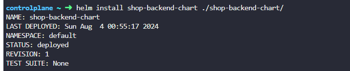
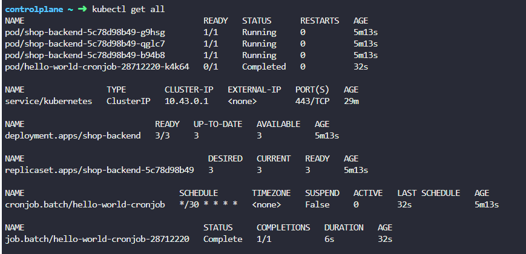

# Shop Backend Helm Chart

This Helm chart deploys a shop backend application and a CronJob to a Kubernetes cluster.

## Prerequisites

- Kubernetes 1.20+
- Helm 3+


## Helm Chart Structure

The Helm chart is organized as follows:

```plaintext
shop-backend-chart/
│
├── Chart.yaml
├── values.yaml
├── templates/
│   ├── deployment.yaml
│   └── cronjob.yaml
└── README.md
```





