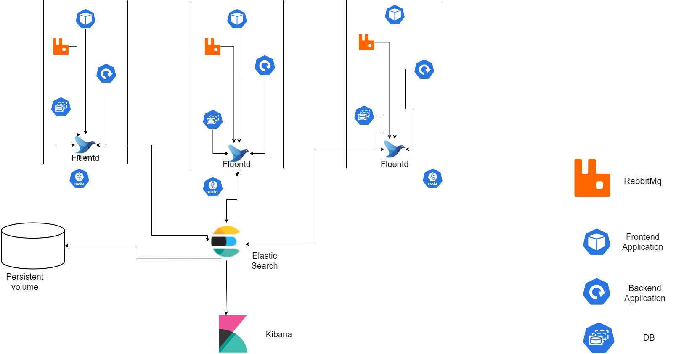

# EFK Stack Overview and Setup

## 1. Overview of EFK Stack

The EFK stack provides a powerful and scalable solution for logging and log management in a Kubernetes environment. The stack consists of:

- **Elasticsearch**: A powerful search and analytics engine used for storing and searching log data.
- **Fluentd**: A data collector used for aggregating and forwarding logs to Elasticsearch.
- **Kibana**: A data visualization and exploration tool used for viewing and analyzing log data stored in Elasticsearch.

## 2. Setting Up Components

### Deploying Fluentd

- **Purpose**: Fluentd will be deployed as a DaemonSet to ensure that it runs on every node in the Kubernetes cluster. It will collect logs from all the pods running on the node.
- **Configuration**: Fluentd configuration will be set up to collect logs from various sources and forward them to Elasticsearch.

### Deploying Elasticsearch

- **Purpose**: Elasticsearch will be deployed as a StatefulSet in Kubernetes to ensure data persistence and scalability.
- **Configuration**: The StatefulSet configuration will ensure that Elasticsearch instances are stable and can be scaled as needed.

### Deploying Kibana

- **Purpose**: Kibana will be deployed as a Deployment to visualize the logs stored in Elasticsearch.
- **Configuration**: The Deployment configuration will manage the Kibana instance and provide a web interface for log analysis.

## 3. Collecting Logs from Various Components

### Frontend Logs

- **Method**: Logs are sent to the backend or directly to Fluentd via HTTP endpoints.
- **Example**: Use an HTTP logging library in the frontend application to send logs to Fluentd.

### Backend Logs

- **Method**: Logs are written to stdout/stderr and collected by Fluentd from `/var/log/containers`.
- **Example**: Configure the application’s logger to output logs to stdout, which Fluentd will collect.

### Database Logs

- **Method**: Fluentd tails database log files or reads logs from the database pod's stdout.
- **Example**: For PostgreSQL, configure logging to stdout, which Fluentd will collect from `/var/log/containers`.

### Message Bus Logs

- **Method**: Logs from message bus services like Kafka are collected via Fluentd plugins or tailed from log files.
- **Example**: Kafka logs are written to log files, which Fluentd tails and forwards to Elasticsearch.

## 4. Conclusion

In a Kubernetes environment, the EFK stack can efficiently aggregate logs from various components. By setting up Fluentd, Elasticsearch, and Kibana, you can achieve a robust and scalable logging solution that centralizes logs from the frontend, backend, database, and message bus. This setup provides comprehensive insights into the health and performance of your applications.

